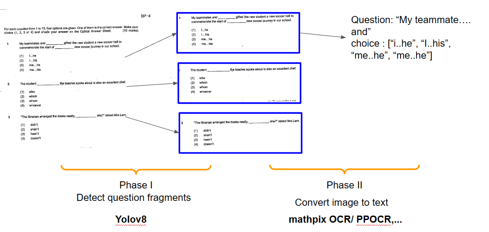

# Detect Question forms from pdf
 


- Example for each module -> [read](notebook/README.md)


## Modules
1. Detection

- Evironment :

```python
!pip install ultralytics #for Yolov8
!pip install opencv-python
!pip install torch
```


## Deploy
				